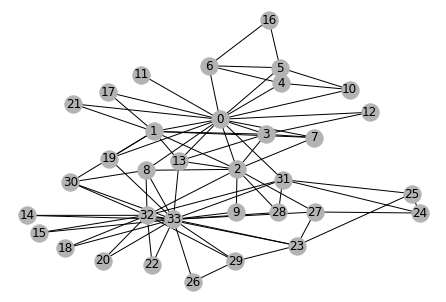
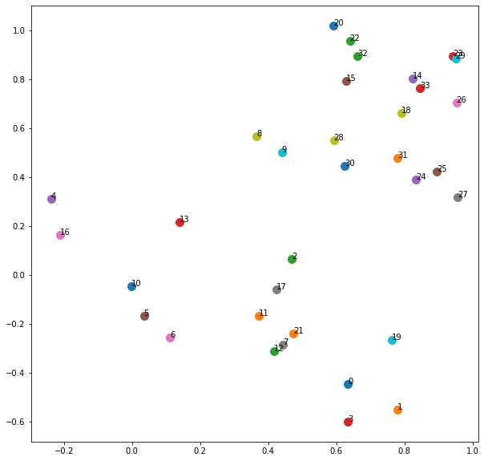

# DeepWalk algorithm for Graph Embedding using Pytorch
Pytorch implementation of DeepWalk and test with Karate Dataset.

## Installation

* Install requirements:
```
pip install -r requirements.txt
```

## How to run

Refer to the example in `KarateDataset.ipynb`

## Input


## Ouput


## Official Code

  * [https://github.com/phanein/deepwalk](https://github.com/phanein/deepwalk)